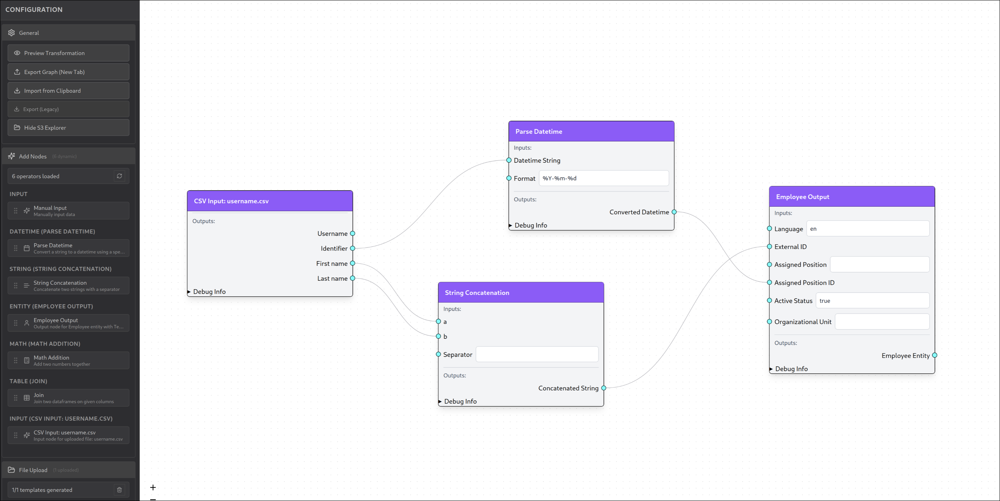

# PFUM - Visual Data Transformation Pipeline



A visual flow editor for building data transformation pipelines with drag-and-drop nodes, type-safe connections, and CSV processing capabilities.

## ⚡ Key Features

**🎨 Visual Pipeline Editor** - Drag-and-drop interface with type-based handle coloring and connection validation  
**📁 CSV File Upload** - Upload CSV files to auto-generate input nodes with column-based outputs  
**🔧 Dynamic Node System** - JSON-configurable transformation nodes loaded from `/public/configs/`  
**💾 Import/Export** - Complete graph serialization for sharing and API integration  
**🎯 Type Safety** - Smart connection validation prevents incompatible data type connections  

## 🚀 Tech Stack

- **Frontend**: React 18, TypeScript, ReactFlow, Tailwind CSS
- **Backend**: FastAPI, Polars, Pydantic  
- **Architecture**: Clean separation with services layer, type-safe schemas

## 📦 Getting Started

```bash
# Frontend
cd frontend && npm install && npm run dev

# Backend  
cd backend && source .venv/bin/activate && python run.py
```

Transform your data visually - upload CSVs, connect processing nodes, export workflows.

---
*Built for intuitive data pipeline creation with enterprise-grade architecture.* 